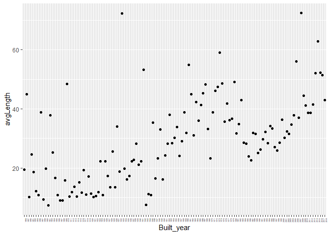

HW1
================
Dingyi Li
2/2/2021

``` r
library(data.table)
library(readr)
```

    ## Warning: package 'readr' was built under R version 4.0.3

``` r
library(tidyverse)
```

    ## Warning: package 'tidyverse' was built under R version 4.0.3

    ## -- Attaching packages ----------------------------------------------------- tidyverse 1.3.0 --

    ## v ggplot2 3.3.2     v dplyr   1.0.2
    ## v tibble  3.0.3     v stringr 1.4.0
    ## v tidyr   1.1.2     v forcats 0.5.0
    ## v purrr   0.3.4

    ## Warning: package 'tidyr' was built under R version 4.0.3

    ## Warning: package 'purrr' was built under R version 4.0.3

    ## Warning: package 'dplyr' was built under R version 4.0.3

    ## Warning: package 'stringr' was built under R version 4.0.3

    ## Warning: package 'forcats' was built under R version 4.0.3

    ## -- Conflicts -------------------------------------------------------- tidyverse_conflicts() --
    ## x dplyr::between()   masks data.table::between()
    ## x dplyr::filter()    masks stats::filter()
    ## x dplyr::first()     masks data.table::first()
    ## x dplyr::lag()       masks stats::lag()
    ## x dplyr::last()      masks data.table::last()
    ## x purrr::transpose() masks data.table::transpose()

### Delimited files

``` r
# Download file
d_file = fread("https://www.fhwa.dot.gov/bridge/nbi/2019/delimited/WI19.txt")
```

``` r
# Create table with selected columns
dt = cbind(d_file$STRUCTURE_NUMBER_008,d_file$YEAR_BUILT_027, d_file$YEAR_RECONSTRUCTED_106, d_file$STATE_CODE_001, d_file$COUNTY_CODE_003, d_file$PLACE_CODE_004,d_file$STRUCTURE_LEN_MT_049, d_file$DESIGN_LOAD_031, d_file$TOLL_020)
colnames(dt)=c("id","Built_year", "Reconstruct_year", "State_code", "County_code", "Place_code","Structure_length","Design_load", "Toll")

dt = as.data.frame(dt)

dt$Structure_length = as.numeric(dt$Structure_length)
```

``` r
dt_filtered = dt %>% group_by(Built_year) %>% summarise(avgLength = mean(Structure_length))
```

    ## `summarise()` ungrouping output (override with `.groups` argument)

``` r
# tiff("bridgePlot.tiff", units="in", width=5, height=5, res=300)
ggplot(dt_filtered, aes(Built_year, avgLength))+
  geom_point()+
  theme(axis.text.x=element_text(size = 3, angle=90))
```

<!-- -->

``` r
# dev.off()
```
